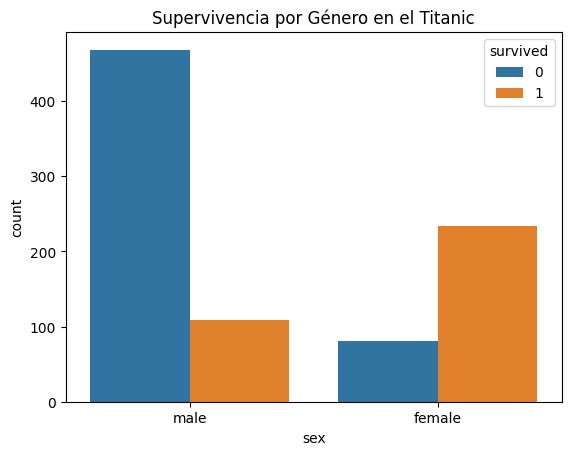

```python
import pandas as pd
import matplotlib.pyplot as plt
import seaborn as sns

# Cargar dataset de ejemplo 
df = pd.read_csv("https://raw.githubusercontent.com/mwaskom/seaborn-data/master/titanic.csv")

# Explorar datos
print(df.head())

# Gráfico de supervivencia por género
sns.countplot(x="sex", hue="survived", data=df)
plt.title("Supervivencia por Género en el Titanic")
plt.show()

```

       survived  pclass     sex   age  sibsp  parch     fare embarked  class  \
    0         0       3    male  22.0      1      0   7.2500        S  Third   
    1         1       1  female  38.0      1      0  71.2833        C  First   
    2         1       3  female  26.0      0      0   7.9250        S  Third   
    3         1       1  female  35.0      1      0  53.1000        S  First   
    4         0       3    male  35.0      0      0   8.0500        S  Third   
    
         who  adult_male deck  embark_town alive  alone  
    0    man        True  NaN  Southampton    no  False  
    1  woman       False    C    Cherbourg   yes  False  
    2  woman       False  NaN  Southampton   yes   True  
    3  woman       False    C  Southampton   yes  False  
    4    man        True  NaN  Southampton    no   True  
    


    

    


```python

```
